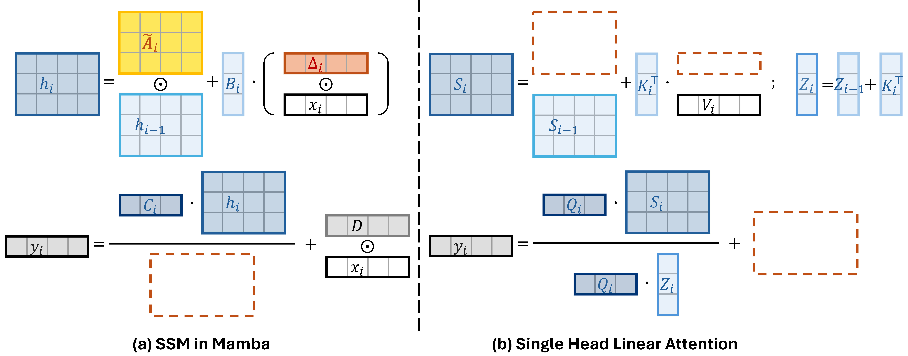
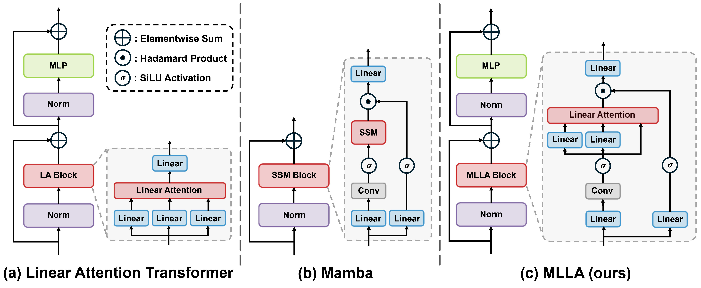
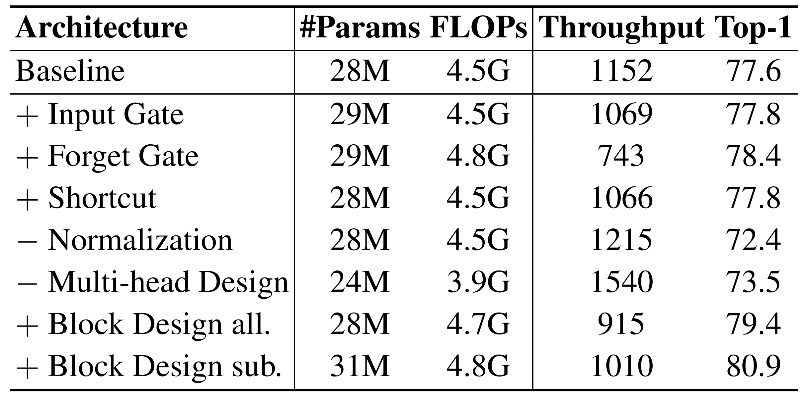
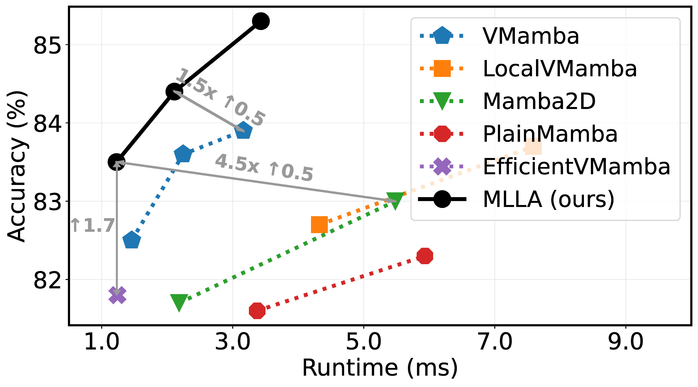
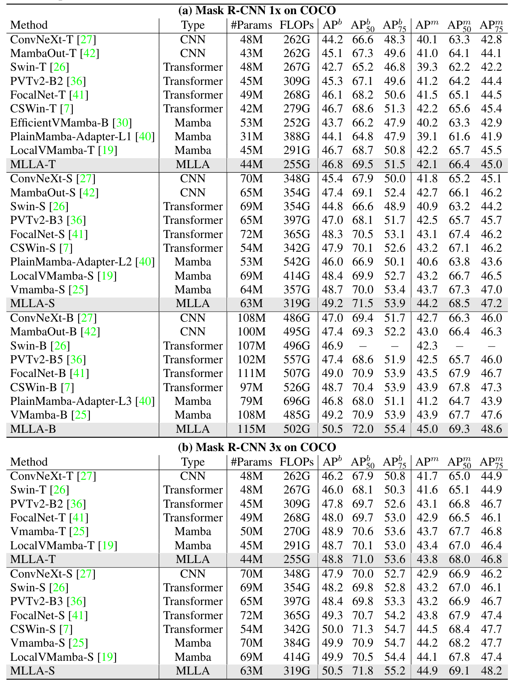
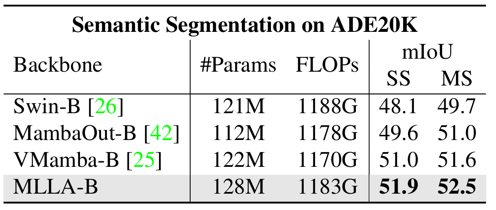

# Demystify Mamba in Vision: A Linear Attention Perspective

This repo contains the official PyTorch code and pre-trained models for **Mamba-Like Linear Attention (MLLA)**, which is renamed as **Mamba-Inspired Linear Attention (MILA)** in the final manuscript based on the suggestion of NeurIPS reviewers.

+ [Demystify Mamba in Vision: A Linear Attention Perspective](https://arxiv.org/abs/2405.16605) [[中文讲解]](https://www.bilibili.com/video/BV1NYzAYxEbZ/?spm_id_from=333.999.0.0&vd_source=b846541b1e7c735e68fcadd44248edf5)


## News

- November 19 2024: Code for [downstream tasks](./downstream) is released.
- September 26 2024: **Accepted to NeurIPS 2024 as a poster.** Final ratings: 6, 7, 7, 7 (6: Weak Accept, 7: Accept).

## Abstract

Mamba is an effective state space model with linear computation complexity. It has recently shown impressive efficiency in dealing with high-resolution inputs across various vision tasks. *In this paper, we reveal that the powerful Mamba model shares surprising similarities with linear attention Transformer, which typically underperform conventional Transformer in practice. By exploring the similarities and disparities between the effective Mamba and subpar linear attention Transformer, we provide comprehensive analyses to demystify the key factors behind Mamba's success.* Specifically, we reformulate the selective state space model and linear attention within a unified formulation, rephrasing Mamba as a variant of linear attention Transformer with six major distinctions: input gate, forget gate, shortcut, no attention normalization, single-head, and modified block design. For each design, we meticulously analyze its pros and cons, and empirically evaluate its impact on model performance in vision tasks. Interestingly, the results highlight the forget gate and block design as the core contributors to Mamba's success, while the other four designs are less crucial. Based on these findings, we propose a **Mamba-Like Linear Attention (MLLA)** model by incorporating the merits of these two key designs into linear attention. The resulting model outperforms various vision Mamba models in both image classification and high-resolution dense prediction tasks, while enjoying parallelizable computation and fast inference speed.

## Connecting Mamba and Linear Attention Transformer

This paper reveals Mamba's close relationship to linear attention Transformer: *Mamba and linear attention Transformer can be formulated within **a unified framework**, with Mamba exhibiting **six distinct designs** compared to the conventional linear attention paradigm: input gate, forget gate, shortcut, no attention normalization, single-head and modified block design.*

- Illustration of selective SSM in Mamba and single head linear attention. It can be seen that selective SSM resembles single-head linear attention with additional input gate $\mathbf{\Delta}_i$, forget gate $\widetilde{\mathbf{A}}_i$ and shortcut $\mathbf{D}\odot \mathbf{x}_i$, while omitting normalization $\mathbf{Q}_i\mathbf{Z}_i$.

<p align="center">
    
</p>


- Illustration of the macro designs of linear attention Transformer, Mamba and our MLLA.

<p align="center">
    
</p>

## Results

- Ablation on the impact of Mamba's each special design.

<p align="center">
    
</p>

- Comparison with SOTA vision Mambas on ImageNet-1K.

<p align="center">
    
</p>

- Real speed measurements. MLLA models benefit from parallelizable computation, resulting in significantly faster inference speeds compared to vision Mamba models.

<p align="center">
    
</p>

- COCO object detection. MLLA offers **effective global modeling** with **linear complexity** $\mathcal{O}(N)$ and **parallelizable computation**, making it ideally suitable for high-resolution image modeling scenarios.

<p align="center">
    
</p>

- ADE20K semantic segmentation.

<p align="center">
    
</p>

## Dependencies

- Python 3.9
- PyTorch == 1.11.0
- torchvision == 0.12.0
- numpy
- timm == 0.4.12
- yacs

The ImageNet dataset should be prepared as follows:

```
imagenet
├── train
│   ├── class1
│   │   ├── img1.jpeg
│   │   └── ...
│   ├── class2
│   │   ├── img2.jpeg
│   │   └── ...
│   └── ...
└── val
    ├── class1
    │   ├── img3.jpeg
    │   └── ...
    ├── class2
    │   ├── img4.jpeg
    │   └── ...
    └── ...
```

## Pretrained Models

| model  | Resolution | #Params | FLOPs | acc@1 |            config            |                      pretrained weights                      |
| ------ | :--------: | :-----: | :---: | :---: | :--------------------------: | :----------------------------------------------------------: |
| MLLA-T |    224     |   25M   | 4.2G  | 83.5  | [config](./cfgs/mlla_t.yaml) | [TsinghuaCloud](https://cloud.tsinghua.edu.cn/f/7a19712877cb4242889c/?dl=1) |
| MLLA-S |    224     |   43M   | 7.3G  | 84.4  | [config](./cfgs/mlla_s.yaml) | [TsinghuaCloud](https://cloud.tsinghua.edu.cn/f/0e5d0b1409d540aaa80c/?dl=1) |
| MLLA-B |    224     |   96M   | 16.2G | 85.3  | [config](./cfgs/mlla_b.yaml) | [TsinghuaCloud](https://cloud.tsinghua.edu.cn/f/91c85c5a1061496d8796/?dl=1) |

## Model Training and Inference

- Evaluate one model on ImageNet:

```
python -m torch.distributed.launch --nproc_per_node=8 main.py --cfg <path-to-config-file> --data-path <imagenet-path> --output <output-path> --eval --resume <path-to-pretrained-weights>
```

- To train `MLLA-T/S/B` on ImageNet from scratch, run:

```
python -m torch.distributed.launch --nproc_per_node=8 main.py --cfg <path-to-config-file> --data-path <imagenet-path> --output <output-path> --amp
```

## Acknowledgements

This code is developed on the top of [Swin Transformer](https://github.com/microsoft/Swin-Transformer), [FLatten Transformer](https://github.com/LeapLabTHU/FLatten-Transformer) and [Agent Attention](https://github.com/LeapLabTHU/Agent-Attention). 

## Citation

If you find this repo helpful, please consider citing us.

```latex
@inproceedings{han2024demystify,
  title={Demystify Mamba in Vision: A Linear Attention Perspective},
  author={Han, Dongchen and Wang, Ziyi and Xia, Zhuofan and Han, Yizeng and Pu, Yifan and Ge, Chunjiang and Song, Jun and Song, Shiji and Zheng, Bo and Huang, Gao},
  booktitle={NeurIPS},
  year={2024},
}
```

## Contact

If you have any questions, please feel free to contact the authors. 

Dongchen Han: [hdc23@mails.tsinghua.edu.cn](mailto:hdc23@mails.tsinghua.edu.cn)
